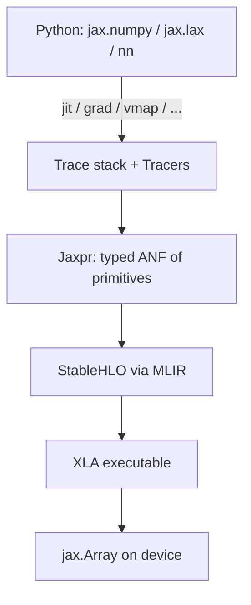
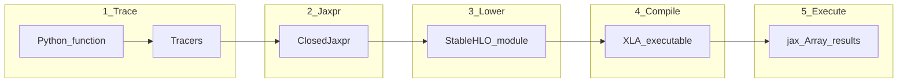

# 01 — Architecture: Python → optimized executable

**Must understand:** the pipeline and *why each stage exists*.  
**Safe to skip:** MLIR/XLA implementation files (listed at the end).

Diagrams: [stack](diagrams/stack.md) · [execution-flow](diagrams/execution-flow.md) · [dependency-map](diagrams/dependency-map.md)

## The stack in one picture



Read this top-down when *writing* models; bottom-up when *debugging performance*.

## Why each layer exists

### 1. Python + `jax.numpy` / `jax.lax`

**Why:** Researchers write NumPy-shaped math, not HLO by hand.

- `jax.numpy` (`jnp`) — high-level, familiar API.
- `jax.lax` — thinner wrappers over primitives (closer to XLA ops: `scan`, `cond`, `dot_general`, …).

You mostly stay in `jnp` + `jax.nn` + library layers. Reach for `lax` when you need control-flow primitives or precise collective/precision control.

### 2. Tracing (Tracers + a Trace stack)

**Why:** Transforms need a *program*, not just a bag of tensors. Tracing runs your Python function with placeholder values (Tracers) so each primitive call can be recorded or rewritten.

Without tracing, there is no `grad` of a Python function, no `vmap` that invents a batch axis, no `jit` that builds a compileable graph.

Deep dive: [03-tracing-and-jaxpr.md](03-tracing-and-jaxpr.md).

### 3. Jaxpr

**Why:** A small, typed IR in administrative normal form (binders + equations + outputs) that *all* transforms can agree on. AD, batching, and partial evaluation rewrite jaxprs (or build them) instead of parsing Python AST.

User microscope:

```python
jax.make_jaxpr(f)(*args)
```

You rarely author jaxprs by hand. You *read* them when debugging “what did JAX actually capture?”

### 4. StableHLO (via MLIR)

**Why:** Portable compiler IR. Jaxpr is great for AD/batching; hardware backends want something closer to the XLA/StableHLO world.

User lever: `jax.jit(f).lower(*args)` — see [docs/aot.md](../docs/aot.md).

### 5. XLA executable

**Why:** Fusion, layout, memory planning, codegen for GPU/TPU/CPU. This is where “why is my matmul slow?” often lives — but as a *user* you interact via shapes, sharding, remat, and precision — not by editing XLA passes.

### 6. `jax.Array` results

**Why:** One array type that carries values, devices, and sharding. Legacy names (`DeviceArray`, `ShardedDeviceArray`, …) are historical; see [05-arrays-and-execution.md](05-arrays-and-execution.md).

## Stages you can name in conversation

Matching the AOT API:

| Stage | Meaning | Typical API |
|-------|---------|-------------|
| Trace | Python runs with Tracers | first call of `jit(f)`, or `make_jaxpr` |
| Jaxpr | Closed program of primitives | `make_jaxpr` output |
| Lowered | StableHLO module | `jit(f).lower(...)` |
| Compiled | Executable + cache key | `.compile()` |
| Execute | Run on device(s) | call jitted fn / compiled |



## Primitives: the atoms

Almost every math op bottoms out in a **`Primitive`**: a named op with rules for:

- abstract evaluation (shape/dtype),
- implementation (eager),
- JVP / VJP,
- batching,
- lowering to MLIR.

**Must know as a user:** “my `jnp.sin` is a primitive call in the jaxpr.”  
**Need not know:** how to register a new primitive (unless you write custom ops / FFI).

Optional later: [docs/jax-primitives.md](../docs/jax-primitives.md). **Skip:** implementing lowerings in [jax/_src/interpreters/mlir.py](../jax/_src/interpreters/mlir.py).

## Where this lives in the repo (orientation only)

| Concern | Touch as user? | Path |
|---------|----------------|------|
| Public transforms API | Skim signatures | [jax/_src/api.py](../jax/_src/api.py) |
| Tracer / Jaxpr / Primitive types | Skim class headers | [jax/_src/core.py](../jax/_src/core.py) |
| AOT stages | Skim concepts | [jax/_src/stages.py](../jax/_src/stages.py) |
| Array type | Skim | [jax/_src/basearray.py](../jax/_src/basearray.py) |
| Real `jit` implementation | **Skip** | [jax/_src/pjit.py](../jax/_src/pjit.py) |
| Jaxpr → MLIR | **Skip** | [jax/_src/interpreters/mlir.py](../jax/_src/interpreters/mlir.py) |
| Compile handoff | **Skip** | [jax/_src/compiler.py](../jax/_src/compiler.py) |
| Dispatch | **Skip** | [jax/_src/dispatch.py](../jax/_src/dispatch.py) |

Full tier list: [SOURCE_MAP.md](SOURCE_MAP.md).

## Mental checklist when something “feels broken”

1. Did Python run under a transform? → tracing rules apply.
2. Did we capture a jaxpr you didn’t expect? → `make_jaxpr`.
3. Are we recompiling every step? → signature / static args / shapes ([06](06-performance-pitfalls.md)).
4. Is work actually finished on device? → async dispatch ([05](05-arrays-and-execution.md)).

## Official companions

- [docs/key-concepts.md](../docs/key-concepts.md)
- [docs/aot.md](../docs/aot.md)
- [docs/jit-compilation.md](../docs/jit-compilation.md)

Next: [02-pytrees.md](02-pytrees.md).
