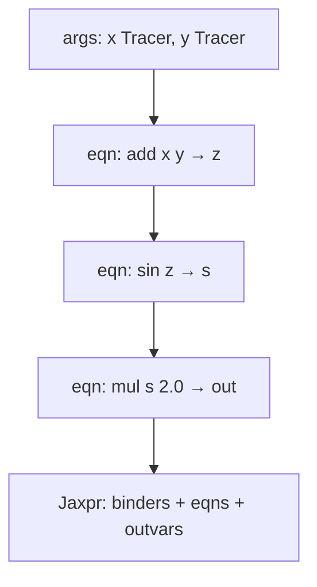

# 03 — Tracing and Jaxpr

**Why these exist:** Transforms need a program. Tracing obtains that program by running Python with **Tracers** instead of concrete arrays. **Jaxpr** is the IR those programs become.

Diagram: [diagrams/tracing.md](diagrams/tracing.md)

Official companions: [docs/tracing.md](../docs/tracing.md), [docs/jaxpr.md](../docs/jaxpr.md), [docs/control-flow.md](../docs/control-flow.md).

## Tracers: shape/dtype stand-ins

Under `jit`, `grad`, `vmap`, etc., array inputs are wrapped so that:

- Python still executes your function body,
- each primitive (`add`, `sin`, `dot_general`, …) is intercepted,
- values you can freely branch on are **not** available unless they are static / concrete.

Conceptually:

```text
Eager:   x is Array with real data  →  if x[0] > 0: ...   OK
Traced:  x is Tracer(ShapedArray(f32[3]))  →  if x[0] > 0: ...   FAILS
```

The failure mode is usually a **concretization** error: JAX needed a concrete Python value (e.g. to decide which branch to take) but only had an abstract tracer.

**This is not a bug.** It is the price of building a compileable, transformable program independent of a particular batch of numbers.

### What you *can* do with tracers

- Call JAX/`jnp`/`lax` ops → recorded / transformed.
- Use shapes/dtypes that are known at trace time (`x.shape[-1]` is often fine when shape is static).
- Use Python control flow on **static** values (`static_argnums`, closed-over constants that don’t change).

### What you *cannot* do (under staging transforms)

- `if tracer > 0:` / `while tracer:` on data-dependent values → use `lax.cond`, `lax.while_loop`, or `lax.scan`.
- Change shapes based on values inside `jit` (no data-dependent `array.shape` mutation).
- Rely on side effects (prints, global lists) to observe intermediate values — use `jax.debug.print` or stage without `jit` first.

## Jaxpr: typed ANF for array programs

A jaxpr is roughly:

```text
lambda binders:  # inputs
  eqn1:  out1 = primitive1(in1, in2, ...)
  eqn2:  out2 = primitive2(...)
  ...
  return outputs
```

Properties that matter to you:

1. **Explicit dataflow** — easy for AD and batching to rewrite.
2. **Primitives only** — no arbitrary Python left (that’s why Python `if` had to be eliminated or made static).
3. **ClosedJaxpr** — jaxpr + constant values closed over during tracing.

### Your microscope: `make_jaxpr`

```python
import jax
import jax.numpy as jnp

def f(x, y):
  return jnp.sin(x + y) * 2.0

print(jax.make_jaxpr(f)(1.0, 2.0))
```

Use this when:

- You’re unsure whether an argument became static or traced.
- A transform “does nothing” or errors — see what was captured.
- You’re learning what `vmap`/`grad` did to your function (compose then `make_jaxpr`).

## Tracing visualization

Source:

```python
def f(x, y):
  z = x + y
  return jnp.sin(z) * 2.0
```

Under a transform:



Python ran once to *build* the jaxpr. Later `jit` executions run the compiled form of that program, not the original Python line-by-line (aside from re-traces when the cache key changes).

## Control flow: the practical rule

| Intent | Prefer |
|--------|--------|
| Data-dependent branch | `lax.cond` |
| Data-dependent loop | `lax.while_loop` |
| Fixed-length / scan over leading axis | `lax.scan` (or `fori_loop`) |
| Branch on Python bool known at trace time | Plain `if` (static) |
| Batch of independent examples | `vmap`, not a Python for-loop of jitted bodies |

`lax.scan` is the workhorse for RNNs, iterative refinement, and transformer block stacking along a “time” or “layer” axis without unrolling Python.

## How this connects to `core.py` (skim only)

In [jax/_src/core.py](../jax/_src/core.py) you will find names that match this chapter:

- `Tracer`, `Trace`
- `AbstractValue`, `ShapedArray`
- `Jaxpr`, `JaxprEqn`, `Var`, `Literal`, `ClosedJaxpr`
- `Primitive`

**Skim:** class docstrings / structure.  
**Do not read:** the entire multi-thousand-line file.  
**Skip for ML work:** most of [jax/_src/interpreters/partial_eval.py](../jax/_src/interpreters/partial_eval.py) (how traces become jaxprs). Autodidax optionally teaches the idea without reading that file.

Public re-exports: [jax/core.py](../jax/core.py).

## Common misconceptions

| Myth | Reality |
|------|---------|
| “JAX parses my Python AST” | It **traces** execution with Tracers |
| “`jit` means no Python runs” | Python runs at **trace** time; then the executable runs |
| “jaxpr is what the GPU runs” | GPU/TPU run **XLA** output; jaxpr is the transform IR |
| “I must understand partial_eval” | Not to train models |

## Mini exercises

1. Write a function with `if x > 0` and call it eagerly (works) vs under `jax.jit` (fails). Replace with `lax.cond`.
2. `make_jaxpr` on `jax.grad(lambda x: x**2)` applied to a scalar — find the JVP/VJP-related structure (or just note equation count vs primal).
3. Close over a Python `bool` flag inside a jitted function; flip the flag and observe recompilation behavior (preview of [06](06-performance-pitfalls.md)).

## Debugging pointer

When you see concretization errors, go to [07-debugging.md](07-debugging.md). The fix is almost always: make the value static, or express control flow with `lax.*`, or don’t `jit` that part yet.

Next: [04-transformations.md](04-transformations.md).
