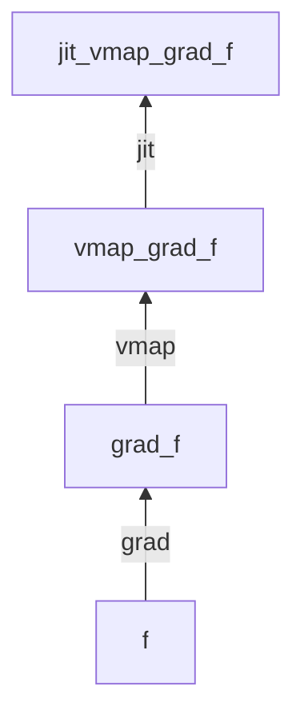
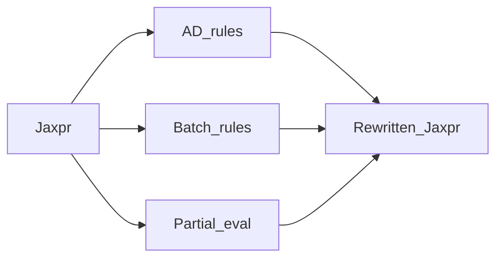

# 04 — Transformations: jit, grad, vmap, and parallel

**Why transforms exist:** They are the API. Differentiation, batching, and compilation are not bolted-on modes; they are **function → function** rewrites that compose.

Diagram: [diagrams/transform-composition.md](diagrams/transform-composition.md)

API surface to skim: [jax/_src/api.py](../jax/_src/api.py) (signatures / docstrings — not every line).

## Shared mental model

```text
g = transform(f)   # g is a new callable
y = g(*args)       # may trace, rewrite jaxpr, compile, execute
```

Each transform:

1. Traces (or rewrites) a jaxpr-related representation,
2. Applies rules (JVP/VJP, batch axes, partial eval for compile),
3. Returns a wrapped function.

Composition = nesting wrappers. **Order matters.**



## `grad` / `value_and_grad` / `jvp` / `vjp`

**Purpose:** Differentiation as a transform of a function that returns a scalar (for `grad`).

| API | Use |
|-----|-----|
| `jax.grad(f)` | ∇ of scalar output w.r.t. args (default: arg 0) |
| `jax.value_and_grad(f)` | Forward value + gradients (training steps) |
| `jax.jvp` / `jax.vjp` | Forward- and reverse-mode building blocks |
| `jax.jacfwd` / `jacrev` | Jacobians |

**Why it exists:** Research needs higher-order AD, composition with `vmap`, and custom JVPs — not only `loss.backward()`.

**Common kwargs:** `argnums`, `has_aux` (return side outputs that aren’t differentiated).

```python
loss_and_grad = jax.value_and_grad(loss_fn, has_aux=True)
(loss, aux), grads = loss_and_grad(params, batch)
```

Official: [docs/automatic-differentiation.md](../docs/automatic-differentiation.md), [docs/notebooks/autodiff_cookbook.md](../docs/notebooks/autodiff_cookbook.md).

**Skip unless deep-diving AD rules:** [jax/_src/interpreters/ad.py](../jax/_src/interpreters/ad.py).

## `vmap`

**Purpose:** Automatically batch a function that was written for one example.

**Why it exists:** Per-example gradients, ensembling, batching odd structures — without rewriting ops with an explicit batch dim everywhere.

```python
# grads shaped like a batch of param-pytrees
batched_grad = jax.vmap(jax.grad(loss), in_axes=(None, 0))  # params unbatched, data batched
```

Key knobs: `in_axes`, `out_axes` — which input/output axes are batch axes (`None` = broadcast / not batched).

Official: [docs/automatic-vectorization.md](../docs/automatic-vectorization.md).

**Skip unless deep-diving:** [jax/_src/interpreters/batching.py](../jax/_src/interpreters/batching.py).

## `jit`

**Purpose:** Stage → compile → cache → execute.

**Why it exists:** Fuse ops, run on accelerators efficiently, amortize overhead. Also the boundary where Python control-flow rules kick in hard.

Important knobs:

| Knob | Meaning |
|------|---------|
| `static_argnums` / `static_argnames` | Args treated as compile-time constants (part of cache key) |
| `donate_argnums` | Allow buffer reuse (perf); donated args consumed |
| `device=` | Placement (see arrays / sharding docs) |

```python
@jax.jit
def train_step(params, opt_state, batch):
  ...
```

**Implementation note (name only):** today’s `jax.jit` goes through the **pjit** path ([jax/_src/pjit.py](../jax/_src/pjit.py)). Know that “jit and sharding share machinery.” **Do not read `pjit.py` for proficiency.**

Official: [docs/jit-compilation.md](../docs/jit-compilation.md), [docs/aot.md](../docs/aot.md), [docs/new_docs/201/jit.md](../docs/new_docs/201/jit.md).

## Parallelism: `pmap` → mesh / `jit` / `shard_map`

| Era | API | Status for new code |
|-----|-----|---------------------|
| Classic | `jax.pmap` | Legacy / migrating |
| Modern | Mesh + `NamedSharding` + `jax.jit` | Default SPMD |
| Explicit per-device logic | `shard_map` | When you need map-over-shards |

**Why the shift:** One array type + sharding annotations scales better than a separate “pmap world.”

```text
Prefer learning: jax.sharding, mesh contexts, jit with shardings, shard_map
Defer: memorizing pmap axis_name patterns (still appears in older repos)
```

Official: [docs/parallel.md](../docs/parallel.md), [docs/migrate_pmap.md](../docs/migrate_pmap.md), shard_map docs under advanced guides / `new_docs/201/`.

**Skip:** [jax/_src/pmap.py](../jax/_src/pmap.py) internals unless maintaining old code.

## Composition recipes (research pipelines)

| Pattern | Form | Notes |
|---------|------|-------|
| Training step | `jit(value_and_grad(loss))` | Workhorse |
| Per-example grads | `jit(vmap(grad(loss)))` | DP-SGD, diagnostics |
| Grad of batched mean | `jit(grad(lambda p, b: vmap(loss)(p, b).mean()))` | Usual supervised loss |
| Sequence models | `jit(grad(scan_wrapped_loss))` | Avoid Python loops |
| Memory | `jit(value_and_grad(jax.checkpoint(big_block)))` | Rematerialization |
| Multi-device | sharded `jit` step ± `shard_map` | Systems track |

### Order rules of thumb

1. **`jit` outermost** for a fused training step (usual).
2. **`grad` then `vmap`** → per-example gradients of a scalar loss.
3. **`vmap` then reduce then `grad`** → gradient of a batch objective.
4. Put **`checkpoint` / remat** around the forward pieces you can afford to recompute.
5. Don’t nest `jit` inside `jit` casually — inner jit is often unnecessary and can confuse donation/sharding.

## Higher-order and custom derivatives

When you need research-grade AD:

- `jax.custom_jvp` / `custom_vjp` — redefine derivatives
- `jax.checkpoint` (`remat`) — memory/compute trade
- `stop_gradient` — block AD

Official: autodiff cookbook + [docs/advanced_autodiff.md](../docs/advanced_autodiff.md). Learn these when a paper requires them; not week 1.

## What each transform rewrites (intuition)



You use the **rules** every day; you don’t maintain the rule tables.

## Exercises

1. Implement MSE loss; compare `grad(loss)(w, x, y)` vs `value_and_grad`.
2. `vmap` a single-example loss over a batch; then `grad` of the mean.
3. Wrap the training step in `jit`; deliberately change an input shape and observe recompilation (wall time spike).
4. Skim [examples/mnist_classifier_fromscratch.py](../examples/mnist_classifier_fromscratch.py) and [examples/differentially_private_sgd.py](../examples/differentially_private_sgd.py) for `jit`/`grad`/`vmap` in the wild.

Next: [05-arrays-and-execution.md](05-arrays-and-execution.md). Parallel deep-dive continues there and in week 3 of the [README](README.md).
