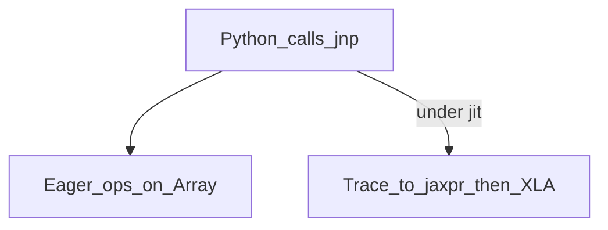

# 05 — Arrays and execution

**Why this chapter exists:** Knowing transforms is not enough — you must know **what a value is**, **where it lives**, and **when work actually finishes**.

## `jax.Array` is the array

Historical names you will see in old blogs and papers:

- `DeviceArray`
- `ShardedDeviceArray`
- `GlobalDeviceArray`

**Today:** one public type story — **`jax.Array`** — which may be sharded across devices. Migration notes: [docs/jax_array_migration.md](../docs/jax_array_migration.md).

Skim: [jax/_src/basearray.py](../jax/_src/basearray.py) (protocol / isinstance).  
Skip deep shard plumbing in [jax/_src/array.py](../jax/_src/array.py) until you do multi-device work.

Official intro: [docs/new_docs/101/arrays.md](../docs/new_docs/101/arrays.md).

## Eager vs staged execution

| Mode | What runs | Good for |
|------|-----------|----------|
| Eager | Ops dispatch as Python hits them | Debugging, tiny experiments |
| `jit` / compiled | Trace once (per signature) → XLA executable | Training, eval, anything hot |

Same `jnp.dot` call sites; different **when** the program is fixed.



## Async dispatch (timing pitfall)

Accelerator work is often **queued asynchronously**. Returning from a jitted function does not guarantee the device finished.

```python
y = compiled(x)
# y may not be ready yet

y.block_until_ready()  # synchronize before timing or host use
```

If you benchmark without blocking, you measure “queue the work,” not “finish the work.”

Official: [docs/async_dispatch.rst](../docs/async_dispatch.rst), FAQ timing notes.

## Devices, placement, sharding

Concepts to separate:

| Concept | Meaning |
|---------|---------|
| **Device** | CPU/GPU/TPU unit JAX can address |
| **Placement** | Which device(s) hold an array |
| **Sharding** | How a logical array is partitioned across devices |
| **Mesh** | Named device grid for SPMD programs |

Single-device research: you can ignore meshes for a while.  
Multi-device / TPU: sharding is how you express data/model parallel layouts — **not** a second array class.

User-facing modules: `jax.sharding`, `jax.device_put`, mesh helpers in docs. Companion: [docs/parallel.md](../docs/parallel.md).

## AOT stages (execution boundaries you can inspect)

From [docs/aot.md](../docs/aot.md) and [jax/_src/stages.py](../jax/_src/stages.py):

```python
jitted = jax.jit(f)
lowered = jitted.lower(x)     # StableHLO-ish view
compiled = lowered.compile()  # XLA executable
y = compiled(x)
```

Use lowering/compile when:

- You want to see what will be compiled before a long run,
- You export/AOT for serving,
- You debug “is this a tracing issue or a compile issue?”

Most training loops just call `jitted(x)` and rely on the cache.

## Host ↔ device and Python objects

- NumPy arrays on the host are not the same as `jax.Array` on device — conversions can sync and cost.
- Printing a device array, or using it in a Python `if` that forces concrete values, can trigger sync / concretization.
- Prefer keeping batches on device across steps when possible.

## Immutability and buffer donation

Arrays are immutable from the Python model’s POV. For performance, `donate_argnums` on `jit` lets XLA reuse buffers for outputs (e.g. update `params` in place at the buffer level). Donated inputs must not be reused afterward.

See [docs/buffer_donation.md](../docs/buffer_donation.md) when optimizing training steps.

## Precision and dtypes

- Default floating compute is often **float32** (64-bit is opt-in).
- Matmul precision / TensorCore behavior can change numerics vs naive NumPy expectations.
- Subnormals and algebraic simplifications under XLA can surprise people comparing to eager NumPy.

Treat “bit-identical to NumPy” as non-goal under `jit`. Treat “stable training / match paper metrics” as the goal.

## Mini checklist before blaming XLA

1. Am I measuring with `block_until_ready`?
2. Am I recompiling every step? ([06](06-performance-pitfalls.md))
3. Are arrays on the intended device/sharding?
4. Did I accidentally sync every iteration (host callback, print, `.item()`)?

## What to skip

- Full [jax/_src/array.py](../jax/_src/array.py) shard implementation
- [jax/_src/dispatch.py](../jax/_src/dispatch.py), [compiler.py](../jax/_src/compiler.py)
- Designing new sharding subclasses

Next: [06-performance-pitfalls.md](06-performance-pitfalls.md).
