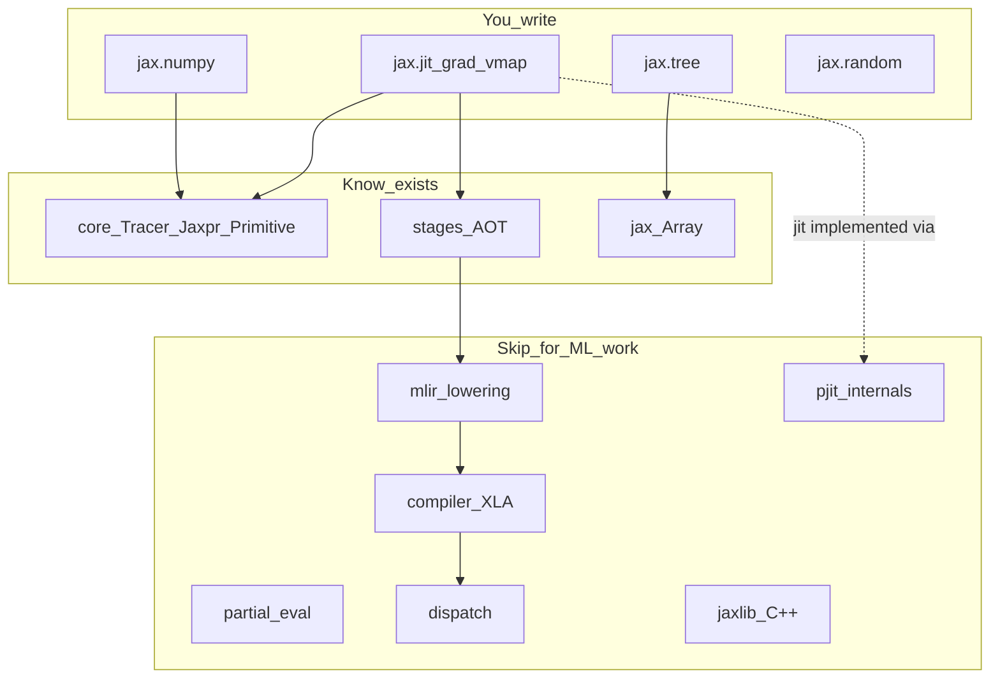

# Dependency map: user surface → internals

What you touch as an ML engineer vs what you can ignore.

## Reading direction

1. **Docs + this guide** for mental models.
2. **Public APIs** (`jax/tree.py`, docstrings in `jax/_src/api.py`) for signatures.
3. **Skim** `core.py` class headers (`Tracer`, `Jaxpr`, `Primitive`) only if debugging IR.
4. **Never required** for research: MLIR, compiler, dispatch, jaxlib C++, full `pjit.py`.
