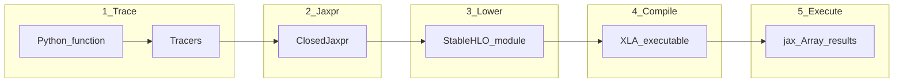

# Execution flow: Python → optimized executable

AOT stages match what you see in `docs/aot.md`.



## What happens on a `jit` call

1. **First call (or new shapes/static args):** trace → jaxpr → lower → compile → cache executable → run.
2. **Later calls with matching signature:** hit cache → run only.
3. **Mismatch** (new shape, new Python bool captured as static, different `static_argnums` value): recompile.

## User-facing AOT API

```python
lowered = jax.jit(f).lower(x)   # stages 1–3
compiled = lowered.compile()    # stage 4
y = compiled(x)                 # stage 5
```

Inspect without executing: `jax.make_jaxpr(f)(x)` stops at stage 2.
