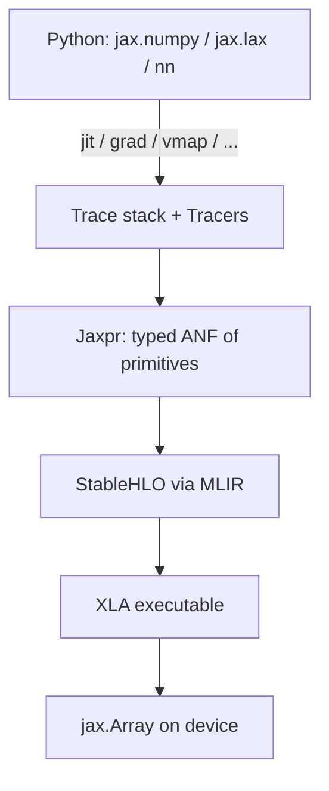

# JAX stack (mental model)

Why each layer exists — not how to implement it.

| Layer | Why it exists | User lever |
|-------|---------------|------------|
| Python APIs | Familiar NumPy-like ergonomics | Write models here |
| Tracing | Capture ops without running them eagerly under transforms | `jit`, `grad`, `vmap`, … |
| Jaxpr | Transformable IR (AD, batching, remat rewrite here) | `jax.make_jaxpr` |
| StableHLO | Portable compiler IR shared with the XLA ecosystem | `.lower()` |
| XLA | Hardware-specific optimization + codegen | `.compile()`, XLA flags |
| `jax.Array` | Values + sharding + devices | Training loops |

**Safe to skip for ML work:** MLIR lowering code, XLA internals, jaxlib C++.
