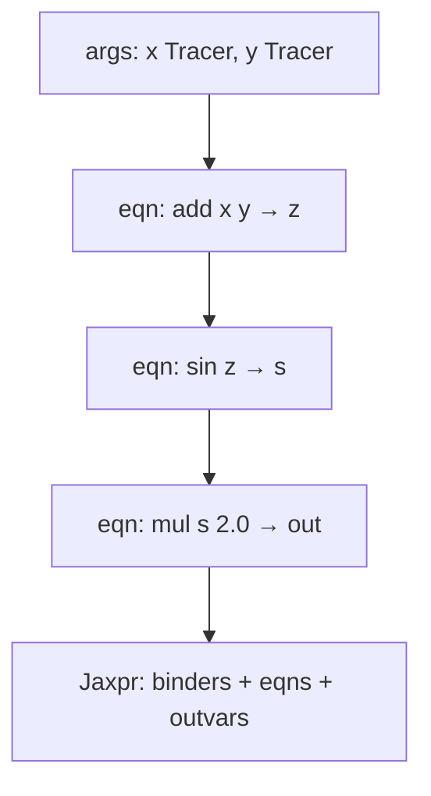

# Tracing visualization

How a tiny function becomes a jaxpr under `jit` (or any staging transform).

## Source

```python
def f(x, y):
  z = x + y
  return jnp.sin(z) * 2.0
```

## Under a transform

Python still runs — but array arguments are **Tracers** (shape/dtype, not concrete values).
Each primitive call records an equation instead of (only) computing a number.



## Concrete vs abstract

| Situation | What you have | Python `if x > 0` |
|-----------|---------------|-------------------|
| Eager (no transform) | Real `jax.Array` values | Works |
| Under `jit` / `vmap` / … | Tracer + `ShapedArray` | **Fails** — needs `lax.cond` or static value |

## Inspect

```python
print(jax.make_jaxpr(f)(1.0, 2.0))
```

You should see equations for `add`, `sin`, `mul` (names may be `add` / `sin` / `mul` primitives under the hood).
