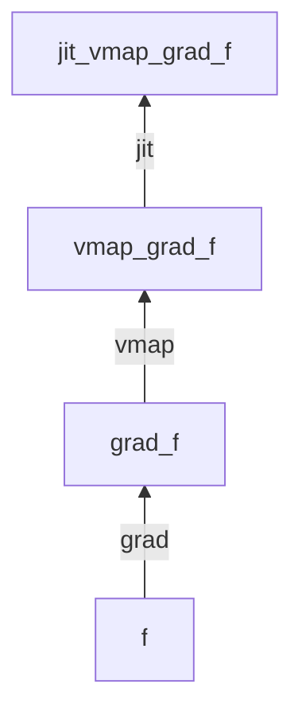
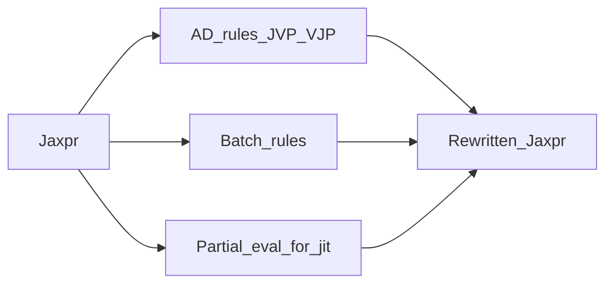

# Transform composition

Transforms are **function → function**. Order matters: each rewrite sees the jaxpr produced by the inner transform.

## Common research pipelines

| Pattern | Typical form | Why |
|---------|--------------|-----|
| Training step | `jit(value_and_grad(loss))` | Fuse forward + backward; one compile |
| Per-example grads | `jit(vmap(grad(loss)))` | Batch of grads without a Python loop |
| Batched loss then grad | `jit(grad(lambda p: vmap(loss)(p, batch).mean()))` | Grad of mean loss |
| Long unroll | `jit(grad(lambda p: scan(step, p, xs)))` | Carry state without Python `for` |
| Memory | `jit(value_and_grad(remat(loss)))` | Trade compute for activation memory |
| Multi-device | `jit` + mesh sharding / `shard_map` | SPMD; prefer over legacy `pmap` |

## Rules of thumb

1. Put **`jit` outermost** when you want one fused executable (usual for training steps).
2. **`grad` inside `vmap`** → per-example gradients; **`vmap` inside `grad`** → grad of a batched scalar (e.g. mean loss).
3. **`pmap` is legacy** for new code: learn mesh + `NamedSharding` + `jit` / `shard_map`.
4. Remat (`jax.checkpoint`) wraps the *forward* you want to recompute during backward.

## What each transform rewrites

You do **not** need to read the interpreter source to use this — but knowing *that* each transform is a jaxpr rewrite explains composition and errors.
